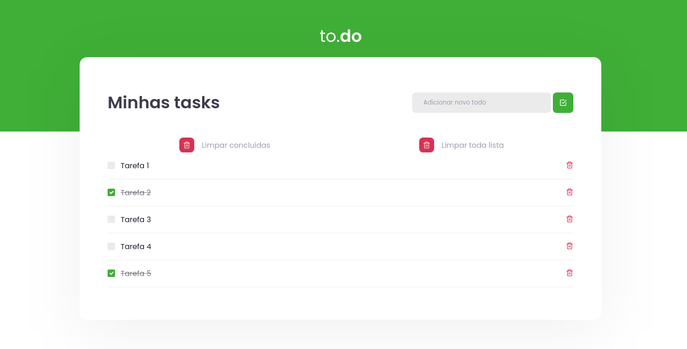

# React Task List

  

## ℹ️ Sobre

O React Task List é um projeto desenvolvido ao longo do Bootcamp Ignite da Rocketseat, com o objetivo de aprofundar os principais conceitos do React, dentre eles, Componente, Estado, Propriedade e Imutabilidade.

## 🚀 Como executar

- Clone o repositório
- Instale as dependências com `yarn`
- Inicie o servidor com `yarn dev`

A aplicação pode ser acessada em [`localhost:8080`](http://localhost:8080).

## 📄 Licença

Esse projeto está sob a licença MIT. Veja o arquivo [LICENSE](LICENSE) para mais detalhes.

---

Feito por Gabriel Timm.